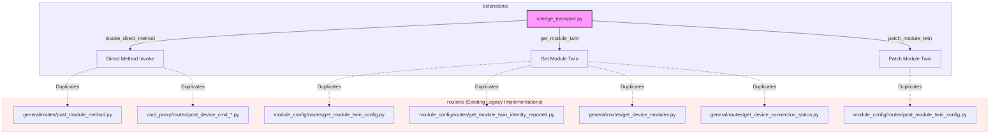
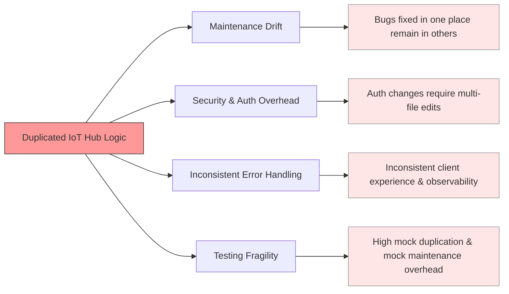
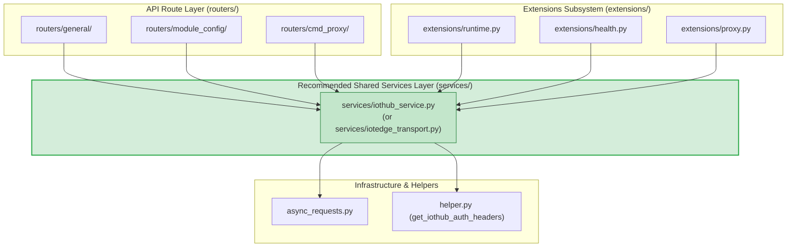

# Analysis of Code Duplication: `extensions/iotedge_transport.py`

## 1. Executive Summary

During the integration of the extensions feature branch (`dev/extensions`), an adapter module was created at `extensions/iotedge_transport.py` to handle IoT Hub upstream routes (direct method invocation, reading module twins, and patching module twins).

While this module provides a cleaner abstraction, its underlying capabilities replicate logic that already exists in multiple route handlers across `routers/`. This document details the exact duplication, analyzes the risks to the API lifecycle, and provides architectural recommendations on how to consolidate these capabilities.

---

## 2. Findings: Identified Duplications

The module `extensions/iotedge_transport.py` defines three primary functions:

```
extensions/iotedge_transport.py
├── invoke_direct_method(device_id, module_name, method_name, payload)
├── get_module_twin(device_id, module_name)
└── patch_module_twin(device_id, module_name, patch)
```

Each function has one or more direct duplicates across existing routers:



### Detailed Mapping

| Function in `extensions/iotedge_transport.py` | Existing Project Locations | Nature of Duplication / Divergence |
|---|---|---|
| **`invoke_direct_method(...)`** | • `routers/general/routes/post_module_method.py`<br>• `routers/cmd_proxy/routes/post_device_cmd_*.py` | **Identical endpoint and payload structure**: Both call `https://{IOT_HUB_NAME}/twins/{device}/modules/{module}/methods?api-version=2020-05-31-preview`.<br>**Divergence**: `post_module_method` handles dynamic timeout calculation (e.g., restarts get 60s, response timeout calculation) and audit trailing, whereas `iotedge_transport` hardcodes `timeout=45`. |
| **`get_module_twin(...)`** | • `routers/module_config/routes/get_module_twin_config.py`<br>• `routers/module_config/routes/get_module_twin_identity_reported.py`<br>• `routers/general/routes/get_device_modules.py`<br>• `routers/general/routes/get_device_connection_status.py` | **Identical endpoint**: Both query `https://{IOT_HUB_NAME}/twins/{device}/modules/{module}?api-version=2020-05-31-preview`.<br>**Divergence**: Existing route handlers manually parse status codes and construct inline exceptions; `iotedge_transport` centralizes 404/200 checks and returns parsed JSON. |
| **`patch_module_twin(...)`** | • `routers/module_config/routes/post_module_twin_config.py` | **Identical PATCH payload**: Both send `{"properties": {"desired": ...}}` to `https://{IOT_HUB_NAME}/twins/{device}/modules/{module}`.<br>**Divergence**: `post_module_twin_config` couples twin patching directly with Azure Blob storage uploads. |

---

## 3. Impact on the API Lifecycle

Maintaining duplicated IoT Hub transport implementations creates significant operational and maintenance risks throughout the software lifecycle:



### 1. Maintenance Drift & Bug Divergence
- When Azure IoT Hub changes API versions or behaviors, updates must be made in 6+ separate files instead of one centralized transport layer.
- Fixes applied to timeouts, retries, or rate limiting in `routers/` will not automatically apply to `extensions/` (and vice-versa).

### 2. Security and Authentication Discrepancies
- IoT Hub authentication (`get_iothub_auth_headers()`) currently supports SAS tokens and Azure Workload Identity / Managed Identity.
- If additional headers (e.g., distributed tracing headers like `traceparent`, tenant headers, correlation IDs) are added, every duplicated call site must be manually retrofitted.

### 3. Inconsistent Error Handling & API Contracts
- `iotedge_transport.py` raises typed `IoTBackendAPIError(text, status_code)`.
- Other handlers return raw tuples like `(responses[url2].text, responses[url2].status_code)` or raise generic `HTTPException`.
- This inconsistency leaks different error response schemas to clients depending on whether they invoked a general route or an extension route.

### 4. Testing Burden
- Mocks for `async_requests` and IoT Hub endpoints must be re-implemented independently across extension tests (`tests/extensions/`) and router tests (`tests/general/`, `tests/module_config/`).

---

## 4. Recommendations: Where Should These Live?

To ensure clean separation of concerns and maintainability as the extensions system grows, **these functions should not live exclusively inside `extensions/` nor embedded inside route handlers.**

### Target Architecture

Move all IoT Hub transport and communication logic to a dedicated shared service layer:



### Proposed Structure Options

1. **Option A (Recommended): Create a `services/` package**
   - **Path:** `services/iothub_service.py` (or `services/iotedge_client.py`)
   - **Responsibility:** High-level wrapper for all IoT Hub interactions:
     - `invoke_module_method(device_id, module_name, method_name, payload, timeout=...)`
     - `get_module_twin(device_id, module_name)`
     - `patch_module_twin(device_id, module_name, patch)`
     - `get_device_modules(device_id)`
   - **Benefits:**
     - Both `routers/` and `extensions/` import from a single authoritative source.
     - Separates HTTP route parsing (FastAPI) from external Azure communication.
     - Prepares the project for other transport adapters (e.g., local MQTT, direct edge daemon socket) if needed in the future.

2. **Option B (Incremental / Non-breaking): Keep backwards compatibility via `extensions/` import forwarding**
   - Place the implementation in `services/iothub_service.py`.
   - In `extensions/iotedge_transport.py`, re-export the methods:
     ```python
     from services.iothub_service import (
         invoke_direct_method,
         get_module_twin,
         patch_module_twin,
     )
     ```
   - This prevents breaking existing extension feature code while allowing legacy routers to adopt the shared service.
