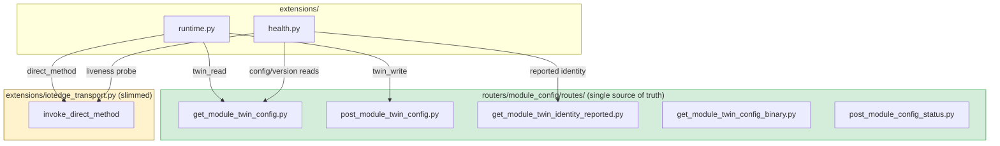

# Suggestions for Fixing Transport Duplication: Module Twin Configuration

## 1. Executive Summary

Following the findings in [iotedge_transport_duplication_analysis.md](iotedge_transport_duplication_analysis.md), this document proposes that **module-twin configuration reads and writes for devices should go exclusively through the services in `routers/module_config/routes/`**, instead of the duplicated transport functions in `extensions/iotedge_transport.py`.

The `module_config` services already encapsulate the correct behavior for module-twin **configurations** (blob-backed storage, SAS-token handling, twin-patch triggering), which `extensions/iotedge_transport.py` partially re-implements in a raw, divergent way.

---

## 2. Methods to Remove from `extensions/iotedge_transport.py`

These are the duplicated methods identified in the duplication analysis that overlap with the module-twin configuration capability:

| Method in `extensions/iotedge_transport.py` | Duplicate in `routers/module_config/routes/` | Overlap | Action |
|---|---|---|---|
| `get_module_twin(device_id, module_name)` | `get_module_twin_config(device, module)` ([get_module_twin_config.py](../../routers/module_config/routes/get_module_twin_config.py)) | Both read the module twin for a device via the IoT Hub REST API (`/twins/{device}/modules/{module}`); `module_config` adds blob-backed config retrieval with IoT Hub as fallback. | **Remove** from `iotedge_transport.py`; callers use `get_module_twin_config`. |
| `patch_module_twin(device_id, module_name, patch)` | `post_module_twin_config(device, module, request)` ([post_module_twin_config.py](../../routers/module_config/routes/post_module_twin_config.py)) | Both PATCH the module twin's desired properties on IoT Hub; `module_config` additionally uploads the config blob and triggers the twin-change event. | **Remove** from `iotedge_transport.py`; callers use `post_module_twin_config`. |
| `invoke_direct_method(device_id, module_name, method_name, payload)` | *(not covered by `module_config`)* | Duplicates `routers/general/routes/post_module_method.py` and `routers/cmd_proxy/routes/post_device_cmd_*.py`, but is **not** a module-twin configuration operation. | **Keep** (out of scope of this document; direct methods are not twin config). |

---

## 3. `module_config` Routes to Use Instead

These existing routes (and their underlying service functions) become the single entry point for getting and posting device module-twin configurations:

| Route | Service Function | Purpose | Replaces |
|---|---|---|---|
| `GET /{device}/twin/config/{module}` | `get_module_twin_config(device, module)` | Returns the current configuration from the module twin (blob-backed, IoT Hub fallback, empty config when module exists without blob). | `iotedge_transport.get_module_twin` (for config reads) |
| `GET /{device}/twin/config/seal-app-net-discover` | `get_module_twin_config(device, "seal-app-net-discover")` | Typed variant returning `GetNetDiscoverModuleConfigV1`. | Same, for the net-discover module. |
| `GET /{device}/twin/config/seal-module-opcua-client` | `get_module_twin_config(device, "seal-module-opcua-client")` | Typed variant returning `OpcuaClientModuleConfigV1`. | Same, for the OPC UA client module. |
| `GET /{device}/twin/config/{module}/binary` | `get_module_twin_config_binary(device, module)` | Binary config assets of the module twin. | Raw-twin reads used to locate binary config. |
| `GET /{device}/twin/identity/{module}/reported` | `get_module_twin_identity_reported(device, module)` | Reported identity properties of the module twin. | Raw-twin reads of reported properties. |
| `POST /{device}/twin/config/seal-module-opcua-client` | `post_module_twin_config(device, "seal-module-opcua-client", request)` | Posts an OPC UA client config: uploads blob, patches desired properties, triggers twin-change event. | `iotedge_transport.patch_module_twin` |
| `POST /{device}/twin/config/seal-app-net-discover` | `post_module_twin_config(device, "seal-app-net-discover", request)` | Posts a net-discover config (same blob + twin-patch flow). | `iotedge_transport.patch_module_twin` |
| `POST /{device}/config/status` | `post_module_config_status(device, module_list)` | Reports module config status. | Complements read-side twin config reporting. |

---

## 4. Required Replacements

### 4.1. In `extensions/health.py`

**Imports**

| Current | Replacement |
|---|---|
| `from extensions import iotedge_transport` | `from routers.module_config.routes.get_module_twin_config import get_module_twin_config` |

**Call sites in `_iotedge_health(...)`**

| Current Call | Replacement | Notes |
|---|---|---|
| `agent = await iotedge_transport.get_module_twin(device_id, "$edgeAgent")` | `agent = await get_module_twin_config(device_id, "$edgeAgent")` | `$edgeAgent` has no blob config, so the fallback branch (module exists ⇒ empty/`None` config) applies. If the health check needs raw reported properties (`modules`, `systemModules`) rather than config, route it through `get_module_twin_identity_reported(device_id, "$edgeAgent")` instead — see the caveat in §5. |
| `twin = await iotedge_transport.get_module_twin(device_id, module_name)` | `twin = await get_module_twin_config(device_id, module_name)` | Same consideration: config read vs. raw twin. For `connectionState` / reported `version`, prefer `get_module_twin_identity_reported(device_id, module_name)`. |
| `except IoTBackendAPIError as exc: ... if exc.status_code == 404:` | Unchanged | `get_module_twin_config` already raises `IoTBackendAPIError` with 404 when the module does not exist, so the `not_deployed` mapping in `_iotedge_health` is preserved. |
| `await iotedge_transport.invoke_direct_method(device_id, module_name, health_method, None)` | Unchanged | Liveness probes are direct methods, not twin config; no replacement required by this proposal. |

### 4.2. In `extensions/runtime.py`

**Imports**

| Current | Replacement |
|---|---|
| `from .iotedge_transport import get_module_twin, invoke_direct_method, patch_module_twin` | `from .iotedge_transport import invoke_direct_method`<br>`from routers.module_config.routes.get_module_twin_config import get_module_twin_config`<br>`from routers.module_config.routes.post_module_twin_config import post_module_twin_config` |

**Call sites in `_make_public_endpoint(...)` (iotedge transport branch)**

| Current Call | Replacement | Notes |
|---|---|---|
| `return await get_module_twin(device_id, rt.module_name)` | `return await get_module_twin_config(device_id, rt.module_name)` | `twin_read` operation now returns the module-twin **configuration** (or `None` when the module exists without config), consistent with `GET /{device}/twin/config/{module}`. |
| `return await patch_module_twin(device_id, rt.module_name, payload)` | `return await post_module_twin_config(device_id, rt.module_name, payload)` | `twin_write` operation now performs the full blob-upload + desired-properties patch flow, consistent with the `POST .../twin/config/...` routes. |

**Call sites in `_make_internal_endpoint(...)` (iotedge transport branch)**

| Current Call | Replacement | Notes |
|---|---|---|
| `return await get_module_twin(device_id, rt.module_name)` | `return await get_module_twin_config(device_id, rt.module_name)` | Same replacement as the public endpoint. |
| `return await patch_module_twin(device_id, rt.module_name, payload)` | `return await post_module_twin_config(device_id, rt.module_name, payload)` | Same replacement as the public endpoint. |
| `return await invoke_direct_method(device_id, rt.module_name, rt.method_name, payload)` | Unchanged | Direct-method invocation is not module-twin config and remains in `iotedge_transport` until consolidated separately. |

---

## 5. Caveats to Resolve Before Applying

1. **Signature mismatch on write**: `post_module_twin_config(device, module, request)` expects a Pydantic request model (it calls `request.model_dump_json(exclude_none=True)`), while `runtime.py` dispatches a free-form JSON `dict`. Either:
   - refactor `post_module_twin_config` to accept a plain `dict` (serializing internally), or
   - wrap the payload in the appropriate config schema (`OpcuaClientModuleConfigV1` / `NetworkDiscoverModuleConfigV1`) before calling.
2. **Raw twin vs. config**: `health.py` currently reads **raw** module twins (`$edgeAgent` reported properties, `connectionState`). The `module_config` services return the **configuration** (blob-backed), not raw twin metadata. If raw twin data is still needed for health, keep a thin raw-twin reader in the shared transport layer (per the analysis' Option A) or use `get_module_twin_identity_reported` where applicable.
3. **Error contracts**: `get_module_twin_config` raises `IoTBackendAPIError` (500) for unexpected failures and 404 for missing modules, matching the handling already present in `health.py`; `post_module_twin_config` raises `UploadError` (400) for blob failures — `runtime.py` should translate this into an `HTTPException` if the proxy layer must not leak internal exception types.

---

## 6. Expected End State



After these replacements, `get_module_twin` and `patch_module_twin` are deleted from `extensions/iotedge_transport.py`, and every module-twin configuration read/write in the API flows through `routers/module_config/routes/`.

---

## 7. Proposed Folder Structure: New `direct_method` Router Under `routers/`

To also absorb the remaining `invoke_direct_method` duplication, a dedicated **`routers/direct_method/`** router should be created following the exact same layout as the existing **`routers/module_config/`** router. Both are highlighted below (`◄`):

```
routers/
├── base_api_router.py
├── schemas.py
│
├── module_config/                                    ◄ EXISTING (reference layout)
│   ├── schemas.py
│   ├── config_schemas/
│   │   ├── network_discover_config_v1.py
│   │   └── seal_module_opcua_client_config_v1.py
│   └── routes/
│       ├── router.py                                 ◄ mounts GET/POST twin-config routes
│       ├── get_module_twin_config.py                 ◄ service: read twin config
│       ├── get_module_twin_config_binary.py
│       ├── get_module_twin_identity_reported.py
│       ├── post_module_twin_config.py                ◄ service: write twin config
│       └── post_module_config_status.py
│
├── direct_method/                                    ◄ NEW ROUTER (to create)
│   ├── schemas.py                                    ◄ NEW: DirectMethodReq / DirectMethodResp models
│   │                                                    (reuse/move DeviceModuleMethodReq
│   │                                                     & DirectMethod from routers/schemas.py)
│   └── routes/
│       ├── router.py                                 ◄ NEW: mounts the routes below,
│       │                                                included in main.py next to
│       │                                                module_config
│       ├── post_module_method.py                     ◄ MOVED from routers/general/routes/
│       │                                                (dynamic timeouts, audit trail)
│       ├── get_device_cmd_status.py                  ◄ MOVED from routers/cmd_proxy/routes/
│       ├── get_device_cmd_ip_config.py               ◄ MOVED from routers/cmd_proxy/routes/
│       ├── get_device_cmd_show_config.py             ◄ MOVED from routers/cmd_proxy/routes/
│       ├── get_device_cmd_fw_config.py               ◄ MOVED from routers/cmd_proxy/routes/
│       ├── post_device_cmd_set_ip_static.py          ◄ MOVED from routers/cmd_proxy/routes/
│       └── post_device_cmd_smartems_check.py         ◄ MOVED from routers/cmd_proxy/routes/
│
├── general/                                          (loses routes/post_module_method.py)
├── cmd_proxy/                                        (emptied; router removed or kept as
│                                                       thin alias during deprecation)
└── ... (auth, devices, compose_deployments, etc.)
```

### Wiring

| File | Change |
|---|---|
| `routers/direct_method/routes/router.py` | New `BaseAPIRouter()` named `direct_method`; re-declares `POST /{device}/{module}/methods` (currently in `routers/general/router.py`) and the `/cmd/*` routes (currently in `routers/cmd_proxy/router.py`), delegating to the route services above. |
| `main.py` | `from routers.direct_method.router import direct_method` + `app.include_router(direct_method)`; drop the `cmd_proxy` include once migrated. |
| `routers/general/router.py` | Remove the `post_module_method` route and its import. |
| `routers/cmd_proxy/` | Remove after migration (or keep a deprecated alias router). |
| `extensions/runtime.py` | `invoke_direct_method` calls in `_make_public_endpoint` / `_make_internal_endpoint` replaced by the shared direct-method service extracted into `routers/direct_method/routes/post_module_method.py`. |
| `extensions/health.py` | Liveness probe (`health_method`) uses the same shared service. |
| `extensions/iotedge_transport.py` | Deleted entirely once `invoke_direct_method` moves into `routers/direct_method/`. |
