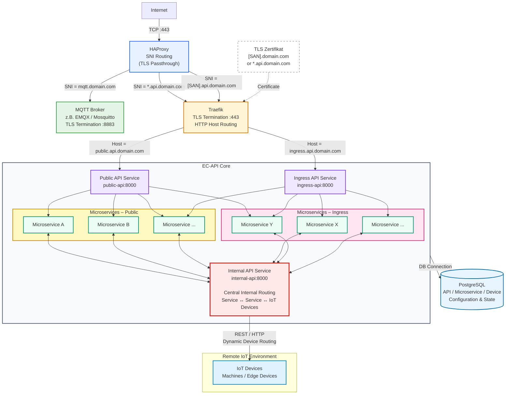

# Principle Overview

The diagramm below shows an coars overview about the extension system.

For detailed architecture description ses here: [Architecture](ARCHITECTURE.md)

The code for the extensions is located in the ``extensions`` folder. The rest of the code is mainly from the auth concept, since this repo was also used for fast prototyping the auth concept.

Every code line in this repo is just for conceptional verification and was 100% generated by AI as a fast prototype.
The concept needs to be transfered in a proper way and by using the [sealman-edge-config-api](https://github.com/eclipse-sealman/sealman-edge-config-api) implementation principes (e.g. code structure, migrations...) to the sealman-edge-config-api repo.

The [Quick Start](#quick-guide) guides through the registartion of demo extensions at the core system.



# Quick Guide

## Prepare dev environment

### Windows

```bash
python -m venv .venv
source .venv/bin/activate
pip install -r requirements.txt
```

### macOS with uv

```bash
uv venv
source .venv/bin/activate
uv pip install -r requirements.txt
```

For iotedge modules there is already a sealman iothub deployed ```iothub-sealman-dev``` [Link](https://portal.azure.com/#@GeaCloud.onmicrosoft.com/resource/subscriptions/68def571-fb99-4c0d-af64-39059cd44e4d/resourceGroups/rg-iothub-sealman-dev/providers/Microsoft.Devices/IotHubs/iothub-sealman-dev/Overview) and a predefined iotedge device called ```device-1``` which has already the modules ```seal-app-opcua``` and ```seal-app-webftp``` virtually genrated for demo purposes like used in [opcua](#opc-ua-example) and [webftp](#webftp-example)

[Here](./iotedge-modules.md) you can find how to get iotedge module connection strings for the demo modules.

**NOTE:**

The ``device-1`` on the demo iothub and its modules can only have one running instance at the same time - means if an other peson uses the same demo device and modules, their entities will kick each other out and the demo will not work.
To be independet from this demo description here, you need to add your own device, e.g. ``device-105`` and register module entities there.

## Start Extensions Demo

### Core Database

```bash
docker compose up
python demo_populate_db.py
```

The database can now be examined with a db-viewer like [DBeaver]() on port ``5434``.
In the device table we should see now a lot of demo device.

### Core

```bash
uvicorn api:app --host 0.0.0.0 --port 9000
```

will spin up 3 routers:
- Public:   http://localhost:9000/docs
- Internal: http://localhost:9001/docs
- Ingress:  http://localhost:9002/docs

### Start demo frontend
Generate demo user token
```bash
python demo_generate_token.py
```
Run ```/frontend/index.html``` in your browser and enter previously generated token and make your user a admin (see screenshot below) and at least fire one backend call e.g. through the UI to register the user.

In the DBs table ``user-context`` you should now see the generated user.


### **Example Extensions**
Each example extension needs to be registered by its ```registration.json``` 
All example extensions can be found in the ```extension_services``` folder.
The are structured like:

```
extension-name/
├── microservices/
│   ├── ms-main-1.py
│   ├── ms-main-2.py
│   └── ...
├── edge-modules/
│   ├── em-main-1.py
│   ├── em-main-2.py
│   └── ...
├── registration.json
└── architecture.md
```

Note that every extension is in the real application an own repository and does NOT live in the seal-edge-config-api core application.

The Extension Builder of the [Demo frontend](#start-demo-frontend) can be used alternivively to register each ``registration.json`` 

The reference ruleset of the registration.json can be found [here](./extension_services/REGISTRATION_JSON_REFERENCE.md).

---

#### **Document-Service Example**

| Extension Name | Extension Details | Registration File |
|----------|----------|----------|
| Document-Service | [Extension Details](./extension_services/document_service/architecture.md)   | [registration.json](./extension_services/document_service/registration.json)     |

Extension components:

- Microservice-1: document-service
```bash
python extension_services/document_service/microservices/main.py --port 7000
```

---

#### **OPC-UA Example**

| Extension Name | Extension Details | Registration File |
|----------|----------|----------|
| OPC-UA | [Extension Details](./extension_services/opcua/architecture.md)   | [registration.json](./extension_services/opcua/registration.json)     |

Extension components:

- Edge-Module-1: seal-app-opcua
```bash
python extension_services/opcua/edge_modules/main.py `
  --connection-string "HostName=...;DeviceId=device-1;ModuleId=seal-app-opcua;SharedAccessKey=..."
```

---

#### **WebFTP Example**

| Extension Name | Extension Details | Registration File |
|----------|----------|----------|
| WebFTP | [Extension Details](./extension_services/webftp/architecture.md)   | [registration.json](./extension_services/webftp/registration.json)    |

Extension components:

- Edge-Module-1: seal-app-webftp
```bash
python extension_services/webftp/edge-modules/main.py `
  --connection-string "HostName=...;DeviceId=device-1;ModuleId=seal-app-webftp;SharedAccessKey=..." `
  --device-key "<DEVICE_KEY>"
```
- Microservice-1: webftp
```bash
python extension_services/webftp/microservices/main.py --internal-key "<INTERNAL_KEY>" --port 7100
```
**!!! Note !!!**

``internal-key`` is provided in the response of the registration call itself. If you missed it you need to de-register and register again.

``device-key`` needs to be generated by ``POST /extensions/{name}/device-keys``

---

#### **Wizard Example**

| Extension Name | Extension Details | Registration File |
|----------|----------|----------|
| Wizard | [Extension Details](./extension_services/wizard_example_interface/architecture.md)   | [registration.json](./extension_services/wizard_example_interface/registration.json)   |

Extension components:

- Edge-Modules-1: seal-app-opcua --> [opcua](#opc-ua-example)
- Edge-Modules-1: seal-app-modbus --> not implemented
- Edge-Modules-1: seal-app-neuronx --> not implemented
- Microservice-1: wizard --> not implemented

## Examine DB Stucture for Extensions

After we registerd now a bunch of extension we can check how the DB stores and loads the extensions.


For detailed DB structure for extensions see [ER diagram](/ARCHITECTURE.md#5-er-diagram-of-the-extension-tables--rbac-link).

